# C++基础

## 1.1程序结构和语句

计算机程序指的是控制计算机完成某件事所需要的一系列**指令**。**语句**是指令的一种，他控制计算机完成的某些操作。

C++中有很多不同类型的语句

1. 声明语句Declaration statements
2. 跳转语句 Jump statements
3. 表达式语句 Expression statements
4. 复合语句 Compoud statements
5. 选择语句（条件）Selection statements(conditionals)
6. 迭代语句（循环）Iteration statements(loops)
7. Try语句块 Try blocks

函数和main函数

在C++中，我们通常会合并使用一组语句，这一组语句称为一个函数。函数就是一组顺序执行（从上向下按顺序执行）的语句的集合。

**每个C++程序都必须包含一个函数名为main的函数。当程序开始运行,main函数中的代码会被顺序执行。**

### Hello world！程序剖析

****

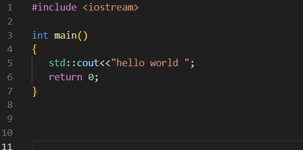

**第一行** 比较特殊，称为[预处理器指令 (preprocessor directive)](https://hanxiaomax.github.io/Learncpp_CN/preprocessor-directive/)。该指令表明用户需要使用 `iostream` 库的内容，该库属于 C++标准库的一部分，程序可以使用该库提供的功能从控制台(console)读写文本。我们需要这一行代码，是为了在第五行使用 `std:: cout`。如果将这一行删除，则会导致第五行编译时报错，因为这样[编译器(compiler)](https://hanxiaomax.github.io/Learncpp_CN/compiler/)就不知道 `std:: cout` 是什么了。

**第三行** 告诉编译器，此处定义一个名为 `main` 的函数。之前我们已经了解到，每个 C++程序都必须有一个 `main` 函数，否则将会[链接(link)](https://hanxiaomax.github.io/Learncpp_CN/link/)失败。

**第四行** 和 **第七行** 告诉编译器接下来哪些行代码属于 `main` 函数。所有位于第四行和第七行括号内的代码，都属于 `main` 函数的一部分，称为函数体。

**第五行** 是 `main` 函数的第一条语句，该语句也是程序执行的第一条语句。`std:: cout`（表示“character output”，即字符输出）和  `<<` 运算符可以将字母或数字从控制台输出。在本例中，我们将字符串文本 “Hello world!” 输出到控制台。这行代码的执行效果就是为程序创建一个可视化的输出结果。

**第六行** 是一个返回语句。当程序执行完毕后，它需要向操作系统返回一个值来表明其执行的结果是成功还是失败。该返回语句向操作系统返回了 0，表示"一切正常"。这是本程序执行的最后一条语句。

## 1.2注释

单行注释：//

多行注释：`/*` 和 `*/` 符号对表示C风格的多行注释。在这两个符号之间的任意内容都会被编译器忽略

**美化**：

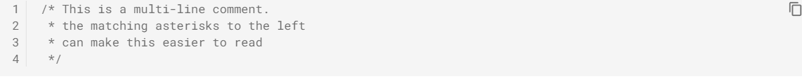

## 1.3对象和变量

所有计算机都有内存，即RAM（随机访问内存）。一个单独的存放在内存中的数据，称为值（value）。

在C++中直接访问内存是不被允许的，我们只能够通过某个对象间接地访问内存。所谓对象，即存放在某个区域（一般来讲为内存），具有值以及其他属性（后续课程会着重介绍）的数据。

一个命名的对象被称为变量，而该对象的名字本身，则称为[标识符(identifier)](https://hanxiaomax.github.io/Learncpp_CN/identifier/)。在C++的程序中，大多数的对象都属于变量。

只要条件允许应该尽可能使用**括号初始化**。

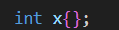

初始化多个变量：

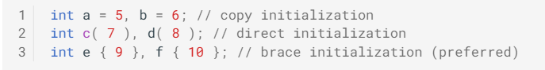

## 1.4-iostream 简介：cout，cin 和 endl

输入输出库 ( IO 库) 是 C++ 标准库的一部分，用于处理基本的输入和输出。

`std::cout`，通过它可以向控制台打印文本，`cout` 代表的含义就是字符输出（character output）。

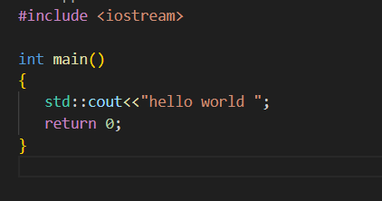

`std::endl`,通过他会打印一个换行符

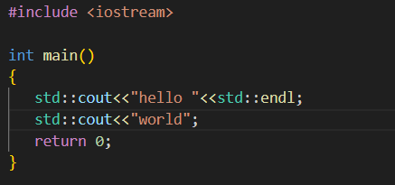

`std::endl`效率比较低一些，换行字符(`\n`)一般来讲是更好的选择。

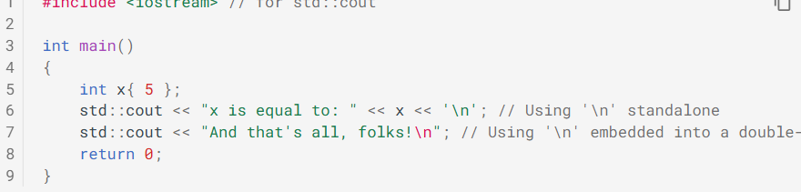

注意在单独使用换行符'\n'时，单引号是必须的。

`std::cin` 是 `iostream` 中预定义的另外一个变量。可以从键盘读取输入。

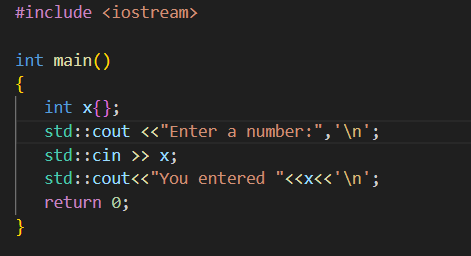

- `std::cin` 和 `std::cout` 总是位于语句的左侧。
- `std::cout` 用于输出 (cout = character output)
- `std::cin` 用于输入 (cin = character input)
- `<<` 配合 `std::cout` 使用，同时也表明了数据的流动方向 (假设 `std::cout` 表示的是控制台，则输出的数据从变量流向控制台）。`std::cout << 4` 就表示将 4 发送到控制台。
- `>>` 配合 `std::cin` 使用，同时也表明了数据的流动方向 (假设 `std::cin` 表示的是键盘，则输入的数据是从键盘流向变量）。`std::cin >> x` 就表示从键盘获取的用户输入被存放到变量 x 中

## 1.6未初始化变量和未定义行为

C/C++ 并不会自动地将大部分变量初始化为某个给定值（例如0）。因此，当编译器为变量分配内存地址时，默认的初值将会是任何恰好位于该地址的值（垃圾值）。一个没有被明确赋予指定初值（通过初始化或赋值）的变量称为**未初始化变量**。

初始化意味着对象在被定义的时候即获得了一个给定的初始值。而未初始化则表示，对象没有被明确地指定任何值（通过各种途径，包括赋值）。因此，一个对象如果没有被”初始化“，但通过赋值得到了一个初值，它也不再是”未初始化“状态（因为它已经得到了一个值）。

使用未定义变量中的值，是我们遇到的第一种会产生未定义行为的例子。未定义行为指的是执行代码的行为没有被C++语言明确定义。此时，C++语言并没有明确的规则能够用于确定这种情况下会发生什么。

**注意避免可能导致未定义行为的各种情况，例如使用未初始化变量。**

## 1.7关键字和标识符

**关键字**

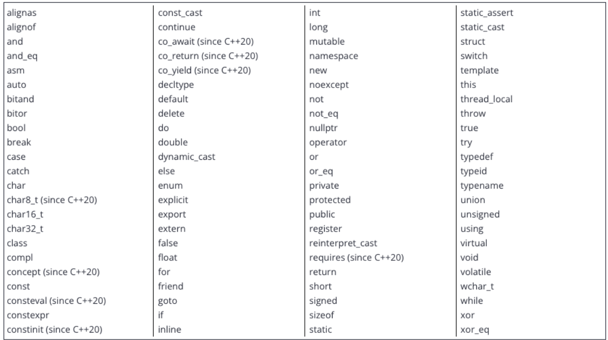

变量（或函数、类型、类型以及其他任何元素）的名称都称为标识符。命名标识符需遵循以下规则：

* 标识符不能是关键字；
* 标识符只能使用大小写字母、数字、下划线；
* 标识符必须以字母（大小写均可）或下划线开头，不能以数字开头；
* C++ 是大小写敏感的，因此它会区分大小写字母。

**最佳实践**

约定俗成的是，变量名应以小写字母开头，变量名是一个单词，整个单词应为小写字母。大多数情况下，函数名同样也是小写字母开头的，大写字母开头的命名符通常用于命名用户类型。

变量名或函数由多个单词组成时，使用下划线分割单词，称为**蛇形命名法**，另外一种用大小写间隔的方法称为**驼峰命名法**

其次，命名时应当避免以下划线开头。

## 1.8空白符和基本排版

C++中，空白指的是空格符、制表符和换行符。C++的编译器通常会忽略空白，即以下代码效果一样

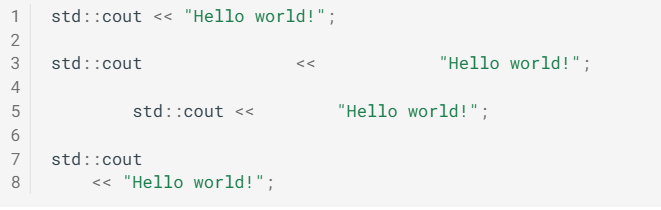

同理，下面的函数效果也一样

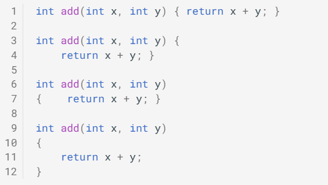

例外：C++并不会忽略引号包裹的字符串的空白，例如

两个字符串是不一样的

在引号包裹的字符串里，换行是不合法的：

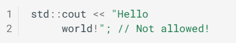

单行代码不应该超过80个字符

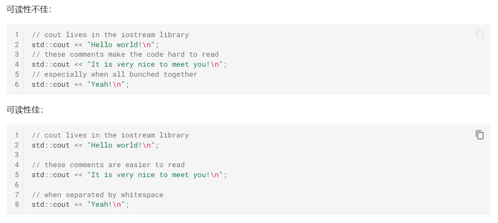

vscode shift+alt+f自动排版

## 1.9 字面量和操作符

 [literals](https://hanxiaomax.github.io/Learncpp_CN/literals/)（也称为字面量常量）指的是被直接插入到源码中的常量。

字面量和变量都具有一个值（及其类型）。但是，字面量的值是固定的，而且不能被修改（所以成为常量），而变量的值是可以改变的，不论是通过初始化还是通过赋值。

**操作符**

数学中的运算指的是一个计算操作，它涉及到0个或多个输入值（称为[操作数](https://hanxiaomax.github.io/Learncpp_CN/operands/)），并能够产生一个新的值（称为输出值）。这个特定的计算操作，通过某种结构（通常是一个或一对符号）来指定，这种结构称之为[运算符(operator)](https://hanxiaomax.github.io/Learncpp_CN/operator/)。

C++中有3种运算符

* **一元** 运算符使用一个操作数。-是一个一元运算符
* **二元**运算符使用两个操作数（左右操作数）。例如3+4
* **三元**运算符使用三个操作数。c++只有一个

**运算符链**

运算符可以进行链式操作，类似数学中的运算顺序。

## 1.10表达式简介

**表达式**是字面量、变量、运算符和函数调用的结合体且最终可以产生一个单值。执行表达式的过程称为求值，最终生成的值则称为表达式的**结果**。

